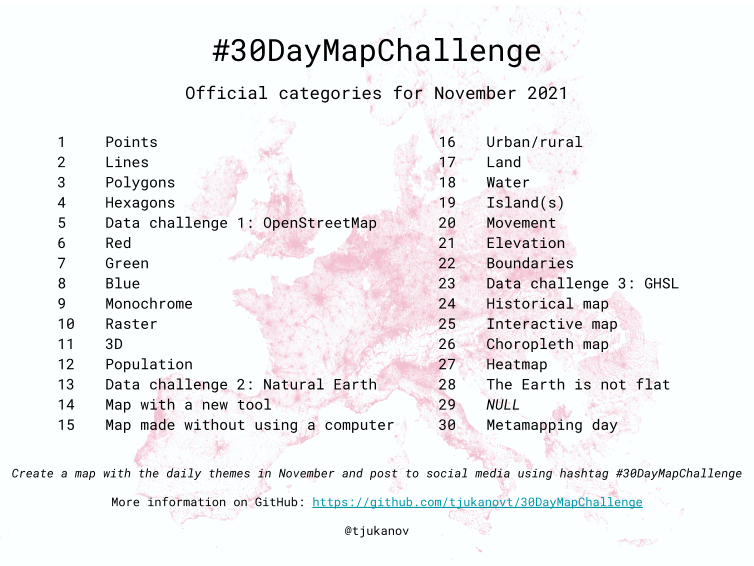

# #30DayMapChallenge

This repository stores my submissions to the #30DayMayChallenge of November 2021.
The original challenge is listed the official repository here: https://github.com/tjukanovt/30DayMapChallenge

## My Submissions
| Day | Challenge Date | Production Date | Theme | Details | Submission |
| --- | --- | --- | --- | --- | --- |
| 1 | 01-11-2021 | 07-11-2021 | Points | A map with points | [link](https://github.com/sepam/30DayMapChallenge-2021/tree/master/day1) |
| 2 | 02-11-2021 | 08-11-2021 | Lines | A map with lines | [link](https://github.com/sepam/30DayMapChallenge-2021/tree/master/day2) |
| 2 | 03-11-2021 |  | Polygons | A map with polygons. | [link]() |

## Data Sources
| Source | Link | Description |
| --- | --- | --- |
| OpenStreetMap | [link](https://www.openstreetmap.org/#map=12/1.3649/103.8229) | Official OpenStreetMap Website |
| Natural Earth Data | [link](https://www.naturalearthdata.com) | Various datasets for natural events and earth data |
| Free GIS Data | [link](https://freegisdata.rtwilson.com) | Categorised list of links to over 500 Geographic datasets |
| GIS Data Repositories | [link](https://docs.google.com/spreadsheets/d/1utQRlrX3lJniBjWE3rNjLZeTRsbjH-zdjxNmXhhvO9Q/edit#gid=50) | A large amount of curated datasources grouped by location, theme, events and others.|
| HDX | [link](https://data.humdata.org) | The Humanitarian Data Exchange|
