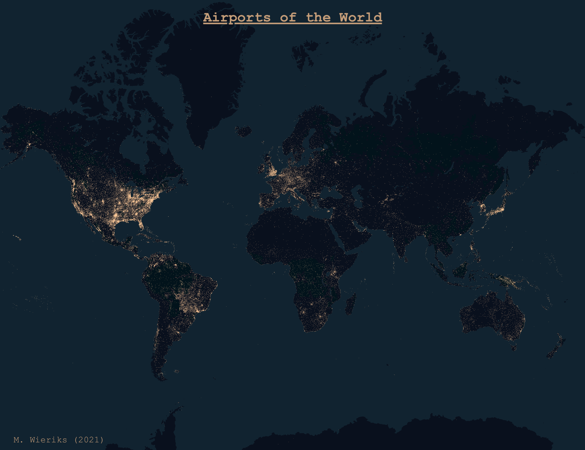

# Day 1  - A map with points
For Day 1, I used location data of airports from [ourairports.com](https://ourairports.com/data/). 
The accompanying notebook shows a simple matplotlib point plot, but the final result of the map (shown below) was 
generated with [kepler.gl](https://kepler.gl/demo).

| Description | URL |
| --- | --- |
| Data source | [CSV](https://davidmegginson.github.io/ourairports-data/airports.csv)
| Map json | [Dropbox (private)](https://www.dropbox.com/sh/n1llsgod3rqw6no/AACF6nWGPwHcHQzwUxQgPmIma?dl=0)

