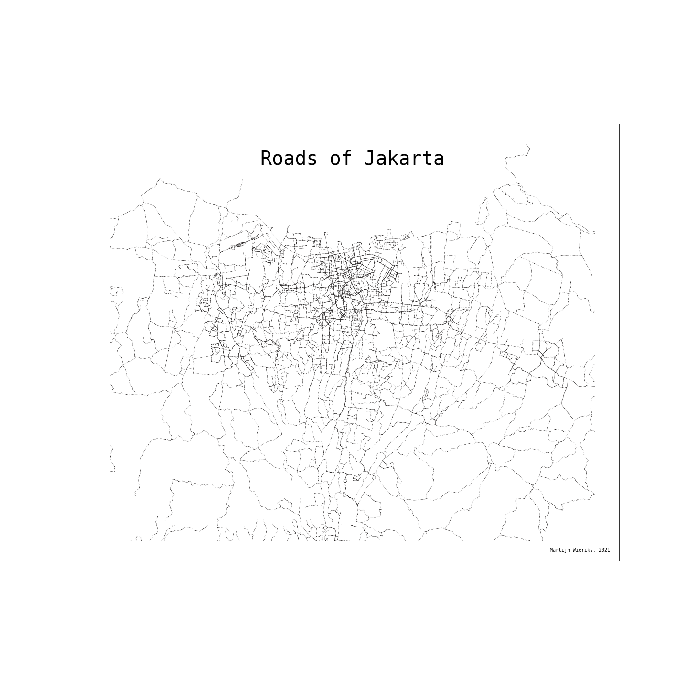

# Day 2 - A map with lines.
For Day 2, I chose to draw out all the primary, secondary and tertiary roads in Jakarta, Indonesia.
Tools used: Geopandas, matplotlib

| Description | URL |
| --- | --- |
| Data source | [link](https://data.humdata.org/dataset/hotosm_idn_jakarta_roads) |
| Map gpkg | [link](https://export.hotosm.org/downloads/fff9e4ef-ceb5-44bb-ae8b-a0262008a9d4/hotosm_idn_jakarta_roads_gpkg.zip) |

